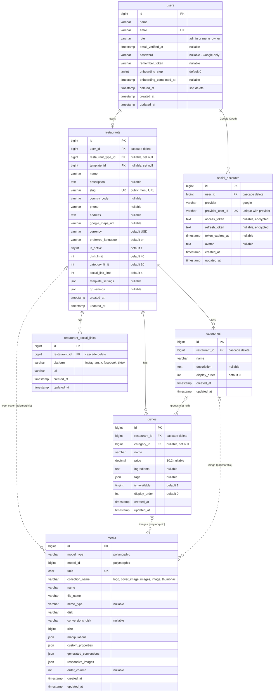
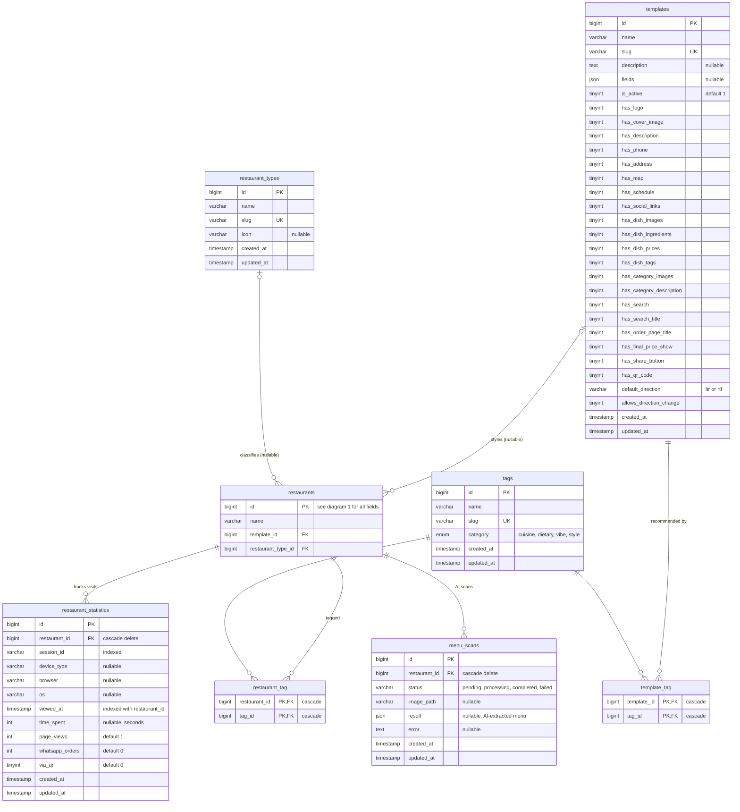

# Qayema — Database ER Diagram

Engine: MySQL · database `menux` · 23 tables. Generated from the live schema (2026-06-09).

Split into three diagrams for readability (GitHub renders each Mermaid block natively).

Notation: `||--o{` one-to-many (FK) · `|o--o{` optional/nullable FK · dotted `..` no real FK
(polymorphic `media`, `sessions.user_id`) · **PK** primary · **FK** foreign · **UK** unique.

## 1. Core menu domain

## 2. Templates, tags & analytics

## 3. Security & framework tables

```mermaid
erDiagram
    blocked_ips {
        bigint id PK
        varchar ip "indexed"
        varchar reason "nullable"
        timestamp expires_at "nullable - null is permanent"
        timestamp created_at
        timestamp updated_at
    }

    contact_messages {
        bigint id PK
        varchar name
        varchar email
        text message
        varchar ip_address "indexed, max 45"
        timestamp created_at
        timestamp updated_at
    }

    sessions {
        varchar id PK
        bigint user_id "nullable, indexed, no FK to users"
        varchar ip_address "nullable, max 45"
        text user_agent "nullable"
        longtext payload
        int last_activity "indexed"
    }

    password_reset_tokens {
        varchar email PK
        varchar token
        timestamp created_at "nullable"
    }

    cache {
        varchar key PK
        mediumtext value
        int expiration
    }

    cache_locks {
        varchar key PK
        varchar owner
        int expiration
    }

    jobs {
        bigint id PK
        varchar queue "indexed"
        longtext payload
        tinyint attempts
        int reserved_at "nullable"
        int available_at
        int created_at
    }

    job_batches {
        varchar id PK
        varchar name
        int total_jobs
        int pending_jobs
        int failed_jobs
        longtext failed_job_ids
        mediumtext options "nullable"
        int cancelled_at "nullable"
        int created_at
        int finished_at "nullable"
    }

    failed_jobs {
        bigint id PK
        varchar uuid UK
        text connection
        text queue
        longtext payload
        longtext exception
        timestamp failed_at "default now"
    }

    migrations {
        int id PK
        varchar migration
        int batch
    }
```

