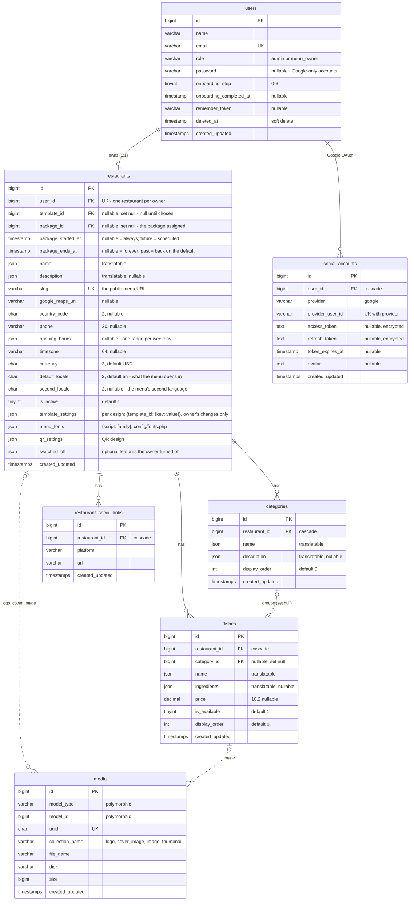
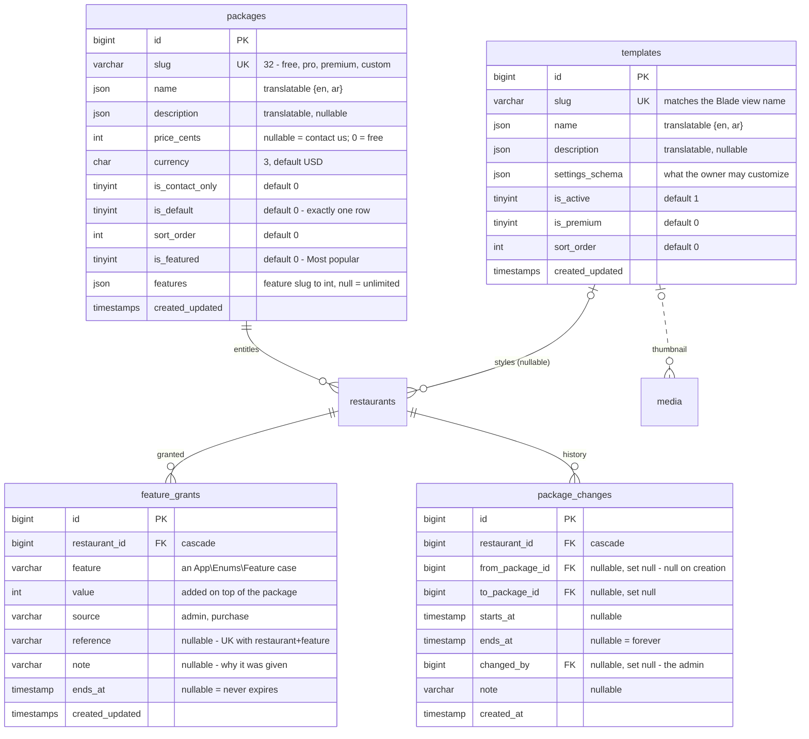
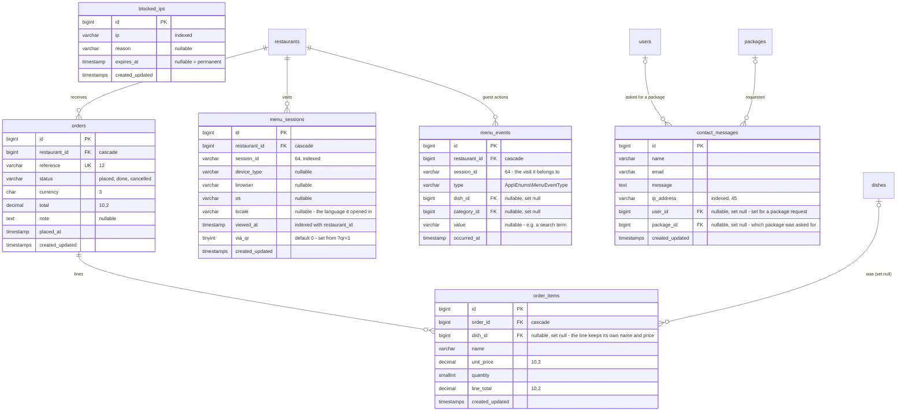

# Qayema — Database ER Diagram

Written from the migrations (2026-09-28). One migration per table.

Notation: `||--o{` one-to-many (FK) · `|o--o{` optional/nullable FK · dotted `..`
no real FK (polymorphic `media`, `sessions.user_id`) · **PK** primary · **FK**
foreign · **UK** unique.

Translatable columns (`name`, `description`, `ingredients`) are
spatie/laravel-translatable JSON keyed by language. Menu text (restaurant,
category, dish) holds English plus the menu's second language; platform text
(package, design) holds `{en, ar}`.

## 1. Core menu domain


```mermaid
erDiagram
    users {
        bigint id PK
        varchar name
        varchar email UK
        varchar role "admin or menu_owner"
        varchar password "nullable - Google-only accounts"
        tinyint onboarding_step "0-3"
        timestamp onboarding_completed_at "nullable"
        varchar remember_token "nullable"
        timestamp deleted_at "soft delete"
        timestamps created_updated
    }

    restaurants {
        bigint id PK
        bigint user_id FK "UK - one restaurant per owner"
        bigint template_id FK "nullable, set null - null until chosen"
        bigint package_id FK "nullable, set null - the package assigned"
        timestamp package_started_at "nullable = always; future = scheduled"
        timestamp package_ends_at "nullable = forever; past = back on the default"
        json name "translatable"
        json description "translatable, nullable"
        varchar slug UK "the public menu URL"
        varchar google_maps_url "nullable"
        char country_code "2, nullable"
        varchar phone "30, nullable"
        json opening_hours "nullable - one range per weekday"
        varchar timezone "64, nullable"
        char currency "3, default USD"
        char default_locale "2, default en - what the menu opens in"
        char second_locale "2, nullable - the menu's second language"
        tinyint is_active "default 1"
        json template_settings "per design: {template_id: {key: value}}, owner's changes only"
        json menu_fonts "{script: family}, config/fonts.php"
        json qr_settings "QR design"
        json switched_off "optional features the owner turned off"
        timestamps created_updated
    }

    categories {
        bigint id PK
        bigint restaurant_id FK "cascade"
        json name "translatable"
        json description "translatable, nullable"
        int display_order "default 0"
        timestamps created_updated
    }

    dishes {
        bigint id PK
        bigint restaurant_id FK "cascade"
        bigint category_id FK "nullable, set null"
        json name "translatable"
        json ingredients "translatable, nullable"
        decimal price "10,2 nullable"
        tinyint is_available "default 1"
        int display_order "default 0"
        timestamps created_updated
    }

    restaurant_social_links {
        bigint id PK
        bigint restaurant_id FK "cascade"
        varchar platform
        varchar url
        timestamps created_updated
    }

    social_accounts {
        bigint id PK
        bigint user_id FK "cascade"
        varchar provider "google"
        varchar provider_user_id "UK with provider"
        text access_token "nullable, encrypted"
        text refresh_token "nullable, encrypted"
        timestamp token_expires_at "nullable"
        text avatar "nullable"
        timestamps created_updated
    }

    media {
        bigint id PK
        varchar model_type "polymorphic"
        bigint model_id "polymorphic"
        char uuid UK
        varchar collection_name "logo, cover_image, image, thumbnail"
        varchar file_name
        varchar disk
        bigint size
        timestamps created_updated
    }

    users ||--o| restaurants : "owns (1:1)"
    users ||--o{ social_accounts : "Google OAuth"
    restaurants ||--o{ categories : "has"
    restaurants ||--o{ dishes : "has"
    categories |o--o{ dishes : "groups (set null)"
    restaurants ||--o{ restaurant_social_links : "has"
    restaurants |o..o{ media : "logo, cover_image"
    dishes |o..o{ media : "image"
```

## 2. Designs, packages & entitlements

What an owner gets in one line: **the package their restaurant is on, while
it is in force, plus any grants on top.** A design grants nothing; one marked
premium needs the `premium_designs` flag.


```mermaid
erDiagram
    templates {
        bigint id PK
        varchar slug UK "matches the Blade view name"
        json name "translatable {en, ar}"
        json description "translatable, nullable"
        json settings_schema "what the owner may customize"
        tinyint is_active "default 1"
        tinyint is_premium "default 0"
        int sort_order "default 0"
        timestamps created_updated
    }

    packages {
        bigint id PK
        varchar slug UK "32 - free, pro, premium, custom"
        json name "translatable {en, ar}"
        json description "translatable, nullable"
        int price_cents "nullable = contact us; 0 = free"
        char currency "3, default USD"
        tinyint is_contact_only "default 0"
        tinyint is_default "default 0 - exactly one row"
        int sort_order "default 0"
        tinyint is_featured "default 0 - Most popular"
        json features "feature slug to int, null = unlimited"
        timestamps created_updated
    }

    feature_grants {
        bigint id PK
        bigint restaurant_id FK "cascade"
        varchar feature "an App\\Enums\\Feature case"
        int value "added on top of the package"
        varchar source "admin, purchase"
        varchar reference "nullable - UK with restaurant+feature"
        varchar note "nullable - why it was given"
        timestamp ends_at "nullable = never expires"
        timestamps created_updated
    }

    package_changes {
        bigint id PK
        bigint restaurant_id FK "cascade"
        bigint from_package_id FK "nullable, set null - null on creation"
        bigint to_package_id FK "nullable, set null"
        timestamp starts_at "nullable"
        timestamp ends_at "nullable = forever"
        bigint changed_by FK "nullable, set null - the admin"
        varchar note "nullable"
        timestamp created_at
    }

    packages ||--o{ restaurants : "entitles"
    templates |o--o{ restaurants : "styles (nullable)"
    restaurants ||--o{ feature_grants : "granted"
    restaurants ||--o{ package_changes : "history"
    templates |o..o{ media : "thumbnail"
```

**How a limit is resolved** — `App\Services\Packages\Entitlements`:

```
effective value = features of the package in force + Σ active feature_grants
```

The package in force is the assigned one between `package_started_at` and
`package_ends_at`, else the default package. Limits add up; flags are on if
anything says on; `null` is unlimited and stays unlimited. A feature missing
from a package's map falls back to `App\Enums\Feature::defaultValue()`.

Cached as `entitlements:{id}` for 300 s or until the next start/end of the
package or a grant, flushed by `FeatureGrant` saved/deleted hooks, by a
restaurant whose package fields changed, and for **every** restaurant when a
package itself is saved.

Every write to a restaurant's package fields adds a `package_changes` row.
Nothing is sold in-app: an owner asks through `POST /api/packages/request`,
which writes a `contact_messages` row carrying `user_id` and `package_id`.

## 3. Orders, analytics, contact & framework tables


```mermaid
erDiagram
    orders {
        bigint id PK
        bigint restaurant_id FK "cascade"
        varchar reference UK "12"
        varchar status "placed, done, cancelled"
        char currency "3"
        decimal total "10,2"
        text note "nullable"
        timestamp placed_at
        timestamps created_updated
    }

    order_items {
        bigint id PK
        bigint order_id FK "cascade"
        bigint dish_id FK "nullable, set null - the line keeps its own name and price"
        varchar name
        decimal unit_price "10,2"
        smallint quantity
        decimal line_total "10,2"
        timestamps created_updated
    }

    menu_sessions {
        bigint id PK
        bigint restaurant_id FK "cascade"
        varchar session_id "64, indexed"
        varchar device_type "nullable"
        varchar browser "nullable"
        varchar os "nullable"
        varchar locale "nullable - the language it opened in"
        timestamp viewed_at "indexed with restaurant_id"
        tinyint via_qr "default 0 - set from ?qr=1"
        timestamps created_updated
    }

    menu_events {
        bigint id PK
        bigint restaurant_id FK "cascade"
        varchar session_id "64 - the visit it belongs to"
        varchar type "App\\Enums\\MenuEventType"
        bigint dish_id FK "nullable, set null"
        bigint category_id FK "nullable, set null"
        varchar value "nullable - e.g. a search term"
        timestamp occurred_at
    }

    blocked_ips {
        bigint id PK
        varchar ip "indexed"
        varchar reason "nullable"
        timestamp expires_at "nullable = permanent"
        timestamps created_updated
    }

    contact_messages {
        bigint id PK
        varchar name
        varchar email
        text message
        varchar ip_address "indexed, 45"
        bigint user_id FK "nullable, set null - set for a package request"
        bigint package_id FK "nullable, set null - which package was asked for"
        timestamps created_updated
    }

    restaurants ||--o{ orders : "receives"
    orders ||--o{ order_items : "lines"
    dishes |o--o{ order_items : "was (set null)"
    restaurants ||--o{ menu_sessions : "visits"
    restaurants ||--o{ menu_events : "guest actions"
    users |o--o{ contact_messages : "asked for a package"
    packages |o--o{ contact_messages : "requested"
```

Also present, unchanged from the framework defaults: `sessions`,
`password_reset_tokens`, `cache`, `cache_locks`, `jobs`, `job_batches`,
`failed_jobs`, and `telescope_*` in local.

## Inspecting the schema

Never wipe the local MySQL to look at the schema. The e2e database is built
from the same migrations and is safe to rebuild:

```bash
composer e2e:reset                                     # fresh e2e database
APP_ENV=e2e php artisan db:show --counts               # tables at a glance
APP_ENV=e2e php artisan db:table restaurants           # one table's columns and indexes
```
