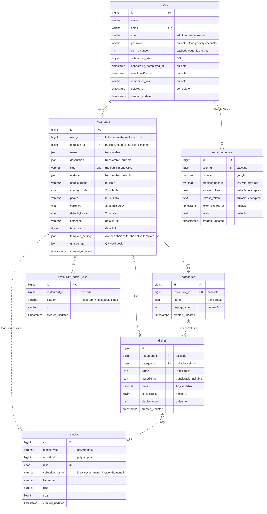
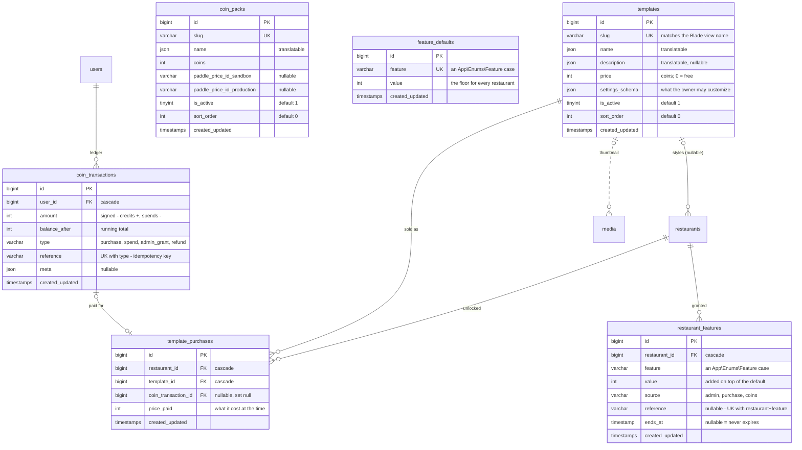
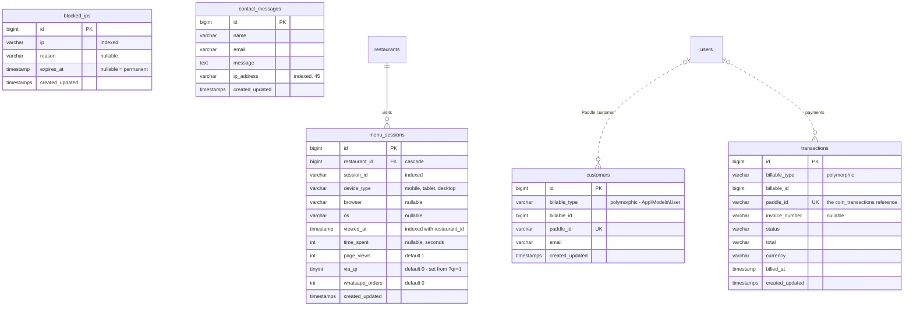

# Qayema — Database ER Diagram

Generated from the live schema (2026-09-22). 23 migrations, one per table.

Notation: `||--o{` one-to-many (FK) · `|o--o{` optional/nullable FK · dotted `..`
no real FK (polymorphic `media`, `sessions.user_id`) · **PK** primary · **FK**
foreign · **UK** unique.

Translatable columns (`name`, `description`, `address`, `ingredients`) are
spatie/laravel-translatable JSON: `{"en": "…", "ar": "…"}`. The owner only ever
writes the locale in `restaurants.default_locale`.

## 1. Core menu domain


```mermaid
erDiagram
    users {
        bigint id PK
        varchar name
        varchar email UK
        varchar role "admin or menu_owner"
        varchar password "nullable - Google-only accounts"
        int coin_balance "cached; ledger is the truth"
        tinyint onboarding_step "0-3"
        timestamp onboarding_completed_at "nullable"
        timestamp email_verified_at "nullable"
        varchar remember_token "nullable"
        timestamp deleted_at "soft delete"
        timestamps created_updated
    }

    restaurants {
        bigint id PK
        bigint user_id FK "UK - one restaurant per owner"
        bigint template_id FK "nullable, set null - null until chosen"
        json name "translatable"
        json description "translatable, nullable"
        varchar slug UK "the public menu URL"
        json address "translatable, nullable"
        varchar google_maps_url "nullable"
        char country_code "2, nullable"
        varchar phone "30, nullable"
        char currency "3, default USD"
        char default_locale "2, ar or en"
        varchar timezone "default UTC"
        tinyint is_active "default 1"
        json template_settings "owner's choices for the active template"
        json qr_settings "QR card design"
        timestamps created_updated
    }

    categories {
        bigint id PK
        bigint restaurant_id FK "cascade"
        json name "translatable"
        int display_order "default 0"
        timestamps created_updated
    }

    dishes {
        bigint id PK
        bigint restaurant_id FK "cascade"
        bigint category_id FK "nullable, set null"
        json name "translatable"
        json ingredients "translatable, nullable"
        decimal price "10,2 nullable"
        tinyint is_available "default 1"
        int display_order "default 0"
        timestamps created_updated
    }

    restaurant_social_links {
        bigint id PK
        bigint restaurant_id FK "cascade"
        varchar platform "instagram, x, facebook, tiktok"
        varchar url
        timestamps created_updated
    }

    social_accounts {
        bigint id PK
        bigint user_id FK "cascade"
        varchar provider "google"
        varchar provider_user_id "UK with provider"
        text access_token "nullable, encrypted"
        text refresh_token "nullable, encrypted"
        timestamp token_expires_at "nullable"
        text avatar "nullable"
        timestamps created_updated
    }

    media {
        bigint id PK
        varchar model_type "polymorphic"
        bigint model_id "polymorphic"
        char uuid UK
        varchar collection_name "logo, cover_image, image, thumbnail"
        varchar file_name
        varchar disk
        bigint size
        timestamps created_updated
    }

    users ||--o| restaurants : "owns (1:1)"
    users ||--o{ social_accounts : "Google OAuth"
    restaurants ||--o{ categories : "has"
    restaurants ||--o{ dishes : "has"
    categories |o--o{ dishes : "groups (set null)"
    restaurants ||--o{ restaurant_social_links : "has"
    restaurants |o..o{ media : "logo, cover_image"
    dishes |o..o{ media : "image"
```

## 2. Templates, coins & entitlements

The money model in one line: **Paddle sells coin packs; everything else is
priced in coins.**


```mermaid
erDiagram
    templates {
        bigint id PK
        varchar slug UK "matches the Blade view name"
        json name "translatable"
        json description "translatable, nullable"
        int price "coins; 0 = free"
        json settings_schema "what the owner may customize"
        tinyint is_active "default 1"
        int sort_order "default 0"
        timestamps created_updated
    }

    template_purchases {
        bigint id PK
        bigint restaurant_id FK "cascade"
        bigint template_id FK "cascade"
        bigint coin_transaction_id FK "nullable, set null"
        int price_paid "what it cost at the time"
        timestamps created_updated
    }

    coin_packs {
        bigint id PK
        varchar slug UK
        json name "translatable"
        int coins
        varchar paddle_price_id_sandbox "nullable"
        varchar paddle_price_id_production "nullable"
        tinyint is_active "default 1"
        int sort_order "default 0"
        timestamps created_updated
    }

    coin_transactions {
        bigint id PK
        bigint user_id FK "cascade"
        int amount "signed - credits +, spends -"
        int balance_after "running total"
        varchar type "purchase, spend, admin_grant, refund"
        varchar reference "UK with type - idempotency key"
        json meta "nullable"
        timestamps created_updated
    }

    feature_defaults {
        bigint id PK
        varchar feature UK "an App\\Enums\\Feature case"
        int value "the floor for every restaurant"
        timestamps created_updated
    }

    restaurant_features {
        bigint id PK
        bigint restaurant_id FK "cascade"
        varchar feature "an App\\Enums\\Feature case"
        int value "added on top of the default"
        varchar source "admin, purchase, coins"
        varchar reference "nullable - UK with restaurant+feature"
        timestamp ends_at "nullable = never expires"
        timestamps created_updated
    }

    restaurants ||--o{ template_purchases : "unlocked"
    templates ||--o{ template_purchases : "sold as"
    templates |o--o{ restaurants : "styles (nullable)"
    users ||--o{ coin_transactions : "ledger"
    coin_transactions |o--o| template_purchases : "paid for"
    restaurants ||--o{ restaurant_features : "granted"
    templates |o..o{ media : "thumbnail"
```

**How a limit is resolved** — `App\Services\Global\Package`:

```
effective value = feature_defaults[feature] + Σ (active restaurant_features grants)
```

Limits add up; flags (`qr_studio`) are on if anything says on. Templates grant
nothing — they are pure design. Cached as `package:{id}` for 300s and flushed by
`RestaurantFeature` saved/deleted hooks.

## 3. Analytics, billing records & framework tables


```mermaid
erDiagram
    menu_sessions {
        bigint id PK
        bigint restaurant_id FK "cascade"
        varchar session_id "indexed"
        varchar device_type "mobile, tablet, desktop"
        varchar browser "nullable"
        varchar os "nullable"
        timestamp viewed_at "indexed with restaurant_id"
        int time_spent "nullable, seconds"
        int page_views "default 1"
        tinyint via_qr "default 0 - set from ?qr=1"
        int whatsapp_orders "default 0"
        timestamps created_updated
    }

    customers {
        bigint id PK
        varchar billable_type "polymorphic - App\\Models\\User"
        bigint billable_id
        varchar paddle_id UK
        varchar email
        timestamps created_updated
    }

    transactions {
        bigint id PK
        varchar billable_type "polymorphic"
        bigint billable_id
        varchar paddle_id UK "the coin_transactions reference"
        varchar invoice_number "nullable"
        varchar status
        varchar total
        varchar currency
        timestamp billed_at
        timestamps created_updated
    }

    blocked_ips {
        bigint id PK
        varchar ip "indexed"
        varchar reason "nullable"
        timestamp expires_at "nullable = permanent"
        timestamps created_updated
    }

    contact_messages {
        bigint id PK
        varchar name
        varchar email
        text message
        varchar ip_address "indexed, 45"
        timestamps created_updated
    }

    restaurants ||--o{ menu_sessions : "visits"
    users |o..o{ customers : "Paddle customer"
    users |o..o{ transactions : "payments"
```

Also present, unchanged from the framework/Cashier defaults: `sessions`,
`password_reset_tokens`, `cache`, `cache_locks`, `jobs`, `job_batches`,
`failed_jobs`, `subscriptions`, `subscription_items` (Cashier requires the
subscription tables; Qayema sells no subscriptions), and `telescope_*` in local.

## Regenerating this file

```bash
php artisan migrate:fresh            # a clean schema
php artisan db:show --counts         # tables at a glance
php artisan db:table restaurants     # one table's columns and indexes
```
